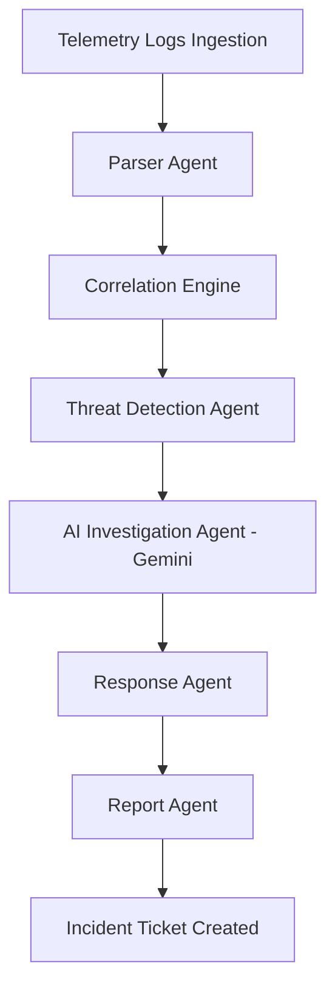

# AI Risk Intelligence Workstation - Platform Documentation

Welcome to the **AI Risk Intelligence Workstation** (Multi-Agent AI SOC & Fintech Fraud Detection Platform). This document outlines the architecture, data pipeline sequence, input entry points, and output locations.

---

## 1. Platform Core Architecture & Workflow
The workstation runs a stateful Multi-Agent AI pipeline that processes telemetry logs, identifies anomalies, and compiles containment playbooks.

### The 7 Ingestion Pipeline Stages:
1. **Inputs Ingested**: Inbound logs are received through manual uploads, pastes, API endpoints, or the demo simulator.
2. **Parser Agent**: Cleans and normalizes unstructured syslog strings using regular expressions, mapping them to structured schema fields.
3. **Correlation Engine**: Groups parsed events within time windows by keys such as Source IP, User, Device, or Merchant.
4. **Threat Detection Agent**: Checks correlation clusters against rule tables (e.g. SSH brute force limits, UPI payout velocity limits) and maps them to MITRE ATT&CK techniques.
5. **AI Investigation Agent (Gemini)**: Triggers autonomous context forensics, evaluating transaction values or device indicators to formulate root causes.
6. **Response Agent**: Computes actionable containment steps (e.g., firewall block rules, active session revokes).
7. **Report Agent**: Synthesizes structured markdown executive audits and compliance reports.

---

## 2. Ingesting Data (Where User Inputs are Entered)

The workstation provides multiple ways to ingest telemetry events under the **DATA INGESTION** section in the sidebar.

| Input Channel | Location | Accepted Format | Description & Reviewer Shortcut |
| :--- | :--- | :--- | :--- |
| **Upload JSON** | `Sidebar → Data Ingestion → Upload JSON` | `.json` file arrays or raw JSON objects | Paste/upload batch logs. Use the **[Auto-load sample JSON]** button to instantly load UPI/payment fraud streams. |
| **Upload CSV** | `Sidebar → Data Ingestion → Upload CSV` | `.csv` files or raw CSV strings | Import tabular log dumps. Use the **[Auto-load sample CSV]** button to load system SSH audit logs. |
| **Paste Raw Logs** | `Sidebar → Data Ingestion → Paste Raw Logs` | Unstructured text syslog streams | Paste raw syslogs. Use **[Auto-load sample Logs]** to load SSH ingress telemetry text. |
| **Ingestion API** | `Sidebar → Data Ingestion → API Integration` | REST API requests with Bearer headers | Integrate custom log forwarders using `POST /api/ingest/security` and `POST /api/ingest/fintech`. |
| **Demo Simulator** | `Dashboard → [TRIGGER MOCK SIMULATOR]` | One-click seeder buttons | Select and execute any of the 20 pre-configured Security or Fintech attack scenarios. |

---

## 3. Platform Outputs (Where Results are Displayed)

Once telemetry logs are analyzed, outputs are routed to the corresponding workstation views:

### A. Operations Dashboard (`Sidebar → Dashboard`)
- **Executive Metrics Grid (KPIs)**: Live counts for Incident Count, Uploaded Events, Simulated Events, and Processed Events. Mapped to Indian Rupees (`₹`) format for fintech logs.
- **Diagnostics Status Panel (Feeds)**: Displays the connectivity status of all ingestion streams (Simulator, Uploads, API, and Transactions Feed).
- **Distribution Charts**: Interactive charts displaying severity breakdowns and chronological risk priority trends.
- **Top Vulnerability Briefs**: Generates lists of prioritized anomalies.

### B. Incident Workspace (`Sidebar → Incidents → Select Incident`)
This is the central panel for case management, organized into 3 columns:
- **LEFT (Consolidation & Logs)**:
  - **Incident Timeline**: Chronological trace tracking raw ingestion, correlation rules matched, AI investigation start, playbooks compiled, and comments logged.
  - **Event Flow Animation**: Pulsing status indicators tracking the consolidation ratio.
  - **Correlated Events**: Shows the detailed log items clustered for this ticket.
- **CENTER (AI Agent Findings)**:
  - **Incident Narrative**: Easy-to-read natural language brief detailing counts, frequencies, and blast radius compiled by the AI agent.
  - **Technical Root Cause**: Underlying mechanism (e.g. CVV testing script, session theft).
  - **Raw Evidence Logs**: Complete list of ingested syslog records.
- **RIGHT (Remediation & Case Actions)**:
  - **Explainability Panel**: Transparent mathematical calculations showing rule triggers, confidence factors, and weights calculations.
  - **Autonomic Playbooks**: Actionable mitigation steps. Click any action to simulate containment block rules.
  - **Analyst Assignments & Notes**: Comment feed to log audit updates, select analysts, or escalate priority to the L3 Crisis Team.

### C. Compliance Reports Directory (`Sidebar → Reports`)
- **Executive Summary / Technical Findings / Mitigations Tabs**: Visual sub-sections of compiled audits.
- **Export Options**: Download compiled incident summaries as **Markdown**, **JSON**, or **CSV** logs, or print as **PDF**.

### D. Audit Log Console (`Sidebar → Audit Logs`)
- **Immutable Log Ledger**: Lists system events (Logins, Ingestions, Deletions, and Escalations) with IP addresses and user attributions for compliance audits.

### E. Health Monitoring diagnostics (`Sidebar → Settings → API Infrastructure`)
- Live connectivity diagnostics showing:
  - Database status (MongoDB Atlas link state).
  - AI Coprocessor status (Gemini API handshake check).
  - Platform Version & Runtime Environment.
  - Live system Uptime counter.
